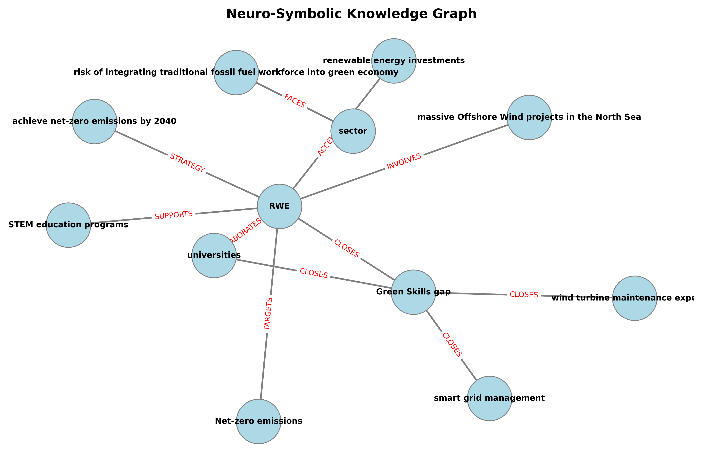

# 🌍 EcoGraph-RAG: Neuro-Symbolic Knowledge Graph for CSR Analysis


**EcoGraph-RAG** is an enterprise-grade Proof of Concept (PoC) demonstrating a Nöro-Symbolic Retrieval-Augmented Generation pipeline. Unlike traditional vector-based RAG systems that rely solely on semantic similarity, this project extracts precise entity-relationship structures from text to build an interactive Knowledge Graph, practically eliminating LLM hallucinations.

This specific implementation is tailored for the **Energy Sector's transition to a net-zero economy**, analyzing Corporate Social Responsibility (CSR) reports to map the gap in 'Green Skills' and human capital transformation strategies.

## 🧠 System Architecture

The pipeline consists of four modular components:
1. **Document Ingestion (`document_loader.py`):** Loads unstructured CSR reports and intelligently chunks them using Recursive Character splitting to preserve semantic boundaries.
2. **Knowledge Extraction (`graph_builder.py`):** Utilizes an LLM constrained to JSON output to extract triplets (Source Node $\rightarrow$ Relationship $\rightarrow$ Target Node) representing companies, sustainability goals, and STEM competencies.
3. **Graph Construction (`retriever.py`):** Converts the extracted Nöro-Symbolic triplets into a directed memory graph using `NetworkX`.
4. **Graph-Grounded Generation (`retriever.py`):** Queries the localized subgraph of a target entity to answer complex user queries with $100\%$ factual grounding based on the source text.

## 📊 Knowledge Graph Visualization

When the pipeline is executed, it automatically generates a visual representation of the Nöro-Symbolic network:


*(The image represents the entity relationships extracted from the sample RWE sustainability report).*

## 🚀 Quick Start

### 1. Clone the Repository
```bash
git clone [https://github.com/Greenstone-Research-Lab/EcoGraph-RAG.git](https://github.com/Greenstone-Research-Lab/EcoGraph-RAG.git)
cd EcoGraph-RAG
```

### 2. Set Up the Virtual Environment

```bash
python -m venv venv
```
#### On Windows
```bash
.\venv\Scripts\activate
```
#### On Mac/Linux
```bash
source venv/bin/activate
```


### 3. Install Dependencies

```bash
pip install -r requirements.txt
```


### 4. Configure Environment Variables
Create a `.env` file in the root directory and add your OpenAI API key:
```env
OPENAI_API_KEY=sk-your-api-key-here
```